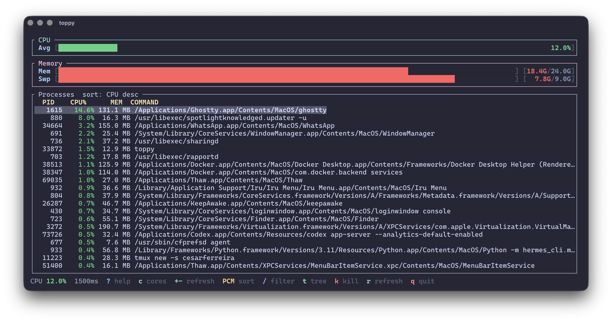

<div align="center">
  <h1>toppy</h1>

  <p><strong>A fast, colorful terminal system monitor — process-focused, keyboard-driven, built in Rust.</strong></p>

  <p>
    
    
    
    <a href="https://crates.io/crates/toppy"></a>
  </p>

  <p>
    <a href="#install">Install</a>
    &nbsp;·&nbsp;
    <a href="#quickstart">Quickstart</a>
    &nbsp;·&nbsp;
    <a href="#footprint">Footprint</a>
    &nbsp;·&nbsp;
    <a href="#keybindings">Keybindings</a>
    &nbsp;·&nbsp;
    <a href="#development">Development</a>
  </p>

  <p>
    
  </p>
</div>

---

## Why toppy

`htop` and `btop` are great — but sometimes you want something lighter, sharper on the columns that matter, and easy to hack on in Rust.

**toppy** is a single binary TUI that puts **PID**, **CPU%**, and **Command** front and center, with colorful per-core CPU bars and memory/swap usage at a glance.

- **Process-first.** Wide command column, sortable PID/CPU/MEM, live filter, tree view.
- **Colorful at a glance.** Green → yellow → red utilization bars for CPU, RAM, and swap.
- **Keyboard-driven.** Sort, filter, kill, tree expand/collapse, help overlay — all from the keyboard.
- **Small and fast.** Rust + [ratatui](https://ratatui.rs) + [sysinfo](https://github.com/GuillaumeGomez/sysinfo). No config files, no mouse required.
- **Cross-platform.** macOS and Linux.

<a id="footprint"></a>
## Footprint

Measured on **macOS arm64** from a release build (`cargo build --release`):

| | |
|---|---|
| **Release binary** | **~1.1 MB** (1,122,192 bytes) |
| **Debug binary** | ~6.0 MB (dev builds only) |
| **Idle RSS** | **~11 MB** (typical while running; ~670 processes on the test machine) |

RSS includes the process list held by `sysinfo`, so it grows slightly on machines with more processes. Virtual size on macOS is much larger and is not a useful “real memory” figure.

To reproduce:

```bash
cargo build --release
ls -lh target/release/toppy
# run toppy, then in another terminal:
ps -o rss,command -p $(pgrep -n toppy)
```

## Install

Requires [Rust](https://rustup.rs) **1.85+** and `~/.cargo/bin` on your `PATH`.

```bash
cargo install toppy
```

Verify:

```bash
toppy --help
```

<details>
<summary><strong>Build from source</strong> — for development or unreleased changes</summary>

```bash
git clone https://github.com/cesarferreira/toppy.git
cd toppy
cargo install --path . --locked
# or
make install-release
```

Debug install (faster compile, larger binary):

```bash
make install
```

Run without installing:

```bash
make build-release
./target/release/toppy
```

</details>

<a id="quickstart"></a>
## Quickstart

Launch the monitor:

```bash
toppy
```

Custom refresh interval (default `1500` ms):

```bash
toppy --refresh-rate 2000
```

Use `+` / `-` while running to adjust the interval (200 ms–10 s).

From the process list:

```bash
# Sort by CPU (default), filter by name, open tree view
# P / C / M / T  → sort columns
# /chrome        → filter processes
# t              → tree view
# k              → kill selected process
# q              → quit
```

## Highlights

### Per-core CPU

One labeled bar per logical core with live utilization and color-coded severity:

```
C0  [████████░░░░░░░░░░] 42.3%
C1  [██████████░░░░░░░░] 51.1%
```

### Memory and swap

RAM and swap usage with human-readable **KB / MB / GB** labels, used/total, and percentage bars.

### Process table

Focused columns for the work you actually do in a monitor:

| PID | CPU% | MEM | COMMAND |
|-----|------|-----|---------|
| 1234 | 45.2 | 1.2 GB | `/Applications/Firefox.app/...` |

The command column uses the full remaining terminal width — no arbitrary truncation.

### Process tree

Press `t` for a full-screen tree view. Expand and collapse branches with `→`, `←`, or `Enter`. Each node still shows PID, CPU%, MEM, and command.

### Kill and filter

- `/` — live filter on command name or PID
- `k` / `F9` — kill menu (`1` = SIGTERM, `2` = SIGKILL)
- `?` / `F1` — help overlay

<a id="keybindings"></a>
## Keybindings

| Key | Action |
|-----|--------|
| `q` | Quit |
| `↑` / `↓` | Move selection |
| `PgUp` / `PgDn` | Page up/down |
| `Home` / `End` | First/last row |
| `P` / `C` / `M` / `T` | Sort by PID / CPU / MEM / Command |
| `/` | Filter by command or PID |
| `Esc` | Clear filter / close overlay |
| `t` | Toggle process tree view |
| `→` / `←` / `Enter` | Expand/collapse tree node |
| `k` / `F9` | Kill selected process |
| `?` / `F1` | Help overlay |
| `+` / `-` | Slower / faster refresh |
| `r` | Force refresh |

In the kill menu: `1` = SIGTERM, `2` = SIGKILL.

## CLI options

| Option | Default | Description |
|--------|---------|-------------|
| `--refresh-rate` | `1500` | Refresh interval in milliseconds |

<a id="development"></a>
## Development

Common tasks via the `Makefile`:

```bash
make              # check + build + test
make build        # debug build
make build-release
make install      # install debug binary
make install-release
make run ARGS="--refresh-rate 500"
make check        # cargo check + clippy
make fmt          # format
make lint           # fmt check + clippy
make test
make clean
make demo         # install + show --help
```

Releasing (requires [cargo-release](https://github.com/crate-ci/cargo-release)):

```bash
make release                  # default minor bump
make release LEVEL=patch      # patch bump
make release LEVEL=major      # major bump
```

The pre-release hook finalizes `CHANGELOG.md` from commits since the latest `v*` tag, refreshes compare links, and leaves a fresh `Unreleased` header. If there are no commits since the last tag, the release stops before publishing.

## Stack

| Component | Crate |
|-----------|-------|
| Language | Rust (edition 2024) |
| TUI | [ratatui](https://crates.io/crates/ratatui) |
| Terminal | [crossterm](https://crates.io/crates/crossterm) |
| System data | [sysinfo](https://crates.io/crates/sysinfo) |
| CLI | [clap](https://crates.io/crates/clap) |

## License

MIT
